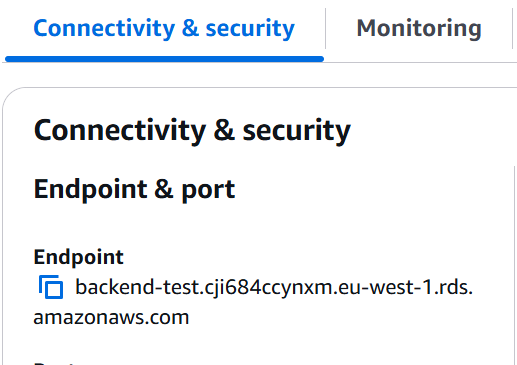
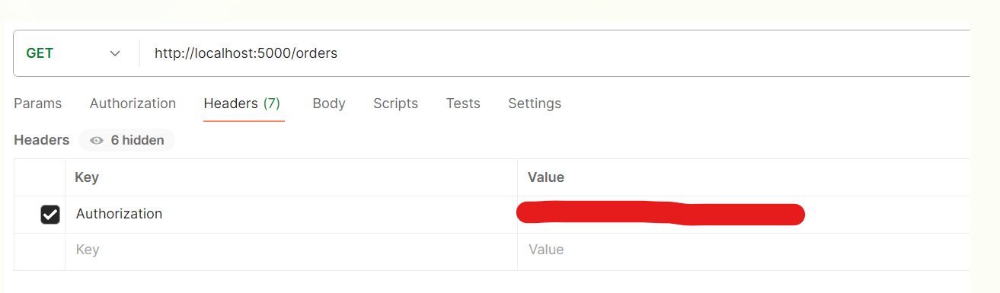

# Simple Backend Test - Instructions to deploy database in AWS and API locally

We will deploy a Postgres RDS instance in AWS, and a Flask API locally with Docker, in order to avoid operational overhead in aws. Because of this, it will be required a little more manual configuration, explained in the next points.

## 0. Contents

- api/
    - contains a simple Python Flask application, hooked to a Postgres RDS instance
    - the application supports a minimal order processing API

- terraform/
    - contains the terraform code necessary to deploy the RDS instance in AWS

## 1. Prereqs

- Docker
- Terraform
- An AWS account and aws-cli installed

## 3. Deployment instructions

0. Copy the '.env' file to the project root and the 'secret.tfvars' to the /terraform folder

1. To authenticate the Terraform AWS provider, set the AWS_ACCESS_KEY_ID and AWS_SECRET_ACCESS_KEY environment variables
```bash
export AWS_ACCESS_KEY_ID=
export AWS_SECRET_ACCESS_KEY=
```

2. Run the script to deploy the rds instance in aws in eu-west-1. It will prompt: type 'yes'. This will take ~4min.
```bash
sh deploy-rds.sh
```

3. Copy the aws endpoint to the .env file variable in the project root
```bash
RDS_HOST='***RDS_ENDPOINT***'
```


4. Run the script to deploy the Flask app locally, with Docker. This will create a Docker container in detached mode.
```bash
sh deploy-app.sh
```

5. To run unittests:
```bash
sh run-unittests.sh
```

6. Test the application on the http://localhost:5000, with the "Authorization" token in the Headers of the request, eg. Postman:
    POST /orders – Create a new order. receives obj with array of { productId, quantity } - {"items": [{"productID": quantity}]}
    GET /orders/{id} – Fetch details of a specific order.
    GET /orders – List all orders.
    DELETE /orders/{id} – Cancel/delete an order.



7. At the end, destroy the db instance and SG created in aws using: (if terminals were changed, it will be needed to export the AWS keys)
```bash
cd terraform
terraform destroy -var-file="secret.tfvars"
```
It will prompt: type 'yes'


## 4. Other considerations
- it would be correct to create a table of Products to create a relation with ProductId in the table orders
- it would be correct to create a table of Users to create a relation with UserId in the table orders
- on the GET /orders and /orders/{id} each user should only see all of his own orders, or an order by id made by him (here we only have one user). An admin user could get everything
- authentication was implemented with a simple token, but should be stronger, eg use Cognito, SSO
- the db created in aws is publicly accessible. this is a security issue, but was made the avoid the operational overhead of creating VPCs, Subnets, SGs, etc
- in order to avoid resources consumption, pagination and rate limiting should be implemented in the API
- api versioning should be implemented, for better control and rollbacks if needed